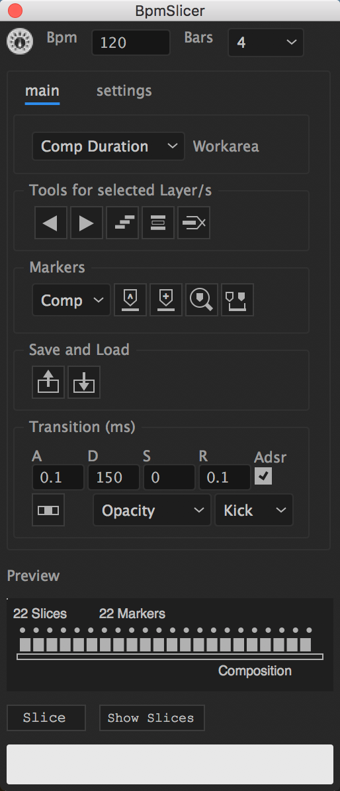

========================
About This Documentation
========================

Description
~~~~~~~~~~~
.. `BpmSlicer`_ is a
This script is is a tool to slice footage layer in a composition into
many pieces which are synchronized to a piece of music. The script
contains a collection of features that migh help to create a music video
such as: Import a txt file that contains slice information (The external
app „Midiconverter“ converts a conventional midi clip into such a
supported txt file). This script can be used to slice a layer to the
beat of a piece of music. For this to work you need to set the Bpm rate
(Beats per minute) of your song.

If you're starting out with BpmSlicer,
read the :doc:`basic_concepts` section first.

1. Select a layer
2. Set the slicing rate (32 bars, 16 bars, 8, 4, 1, 1/4, 1/8, 1/16,
   1/32)
3. Check the ‚Marker‘ checkbox in case you need composition markers for
   all slices
4. Click ‚Slice‘
   

.. _BpmSlicer: http://www.fettdruck.com
