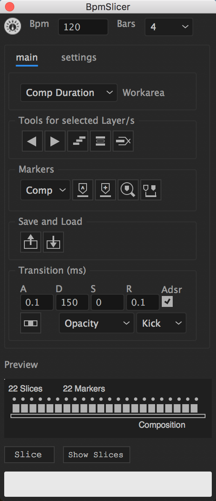

************************
About This Documentation
************************

   BpmSlicer

Description
~~~~~~~~~~~

This script is is a tool to slice footage layer in a composition into
many pieces which are synchronized to a piece of music. The script
contains a collection of features that migh help to create a music video
such as: Import a txt file that contains slice information (The external
app „Midiconverter“ converts a conventional midi clip into such a
supported txt file). This script can be used to slice a layer to the
beat of a piece of music. For this to work you need to set the Bpm rate
(Beats per minute) of your song.

If you're starting out with BpmSlicer,
read the :doc:`getting_started` section first.

.. _BpmSlicer: http://www.fettdruck.com
